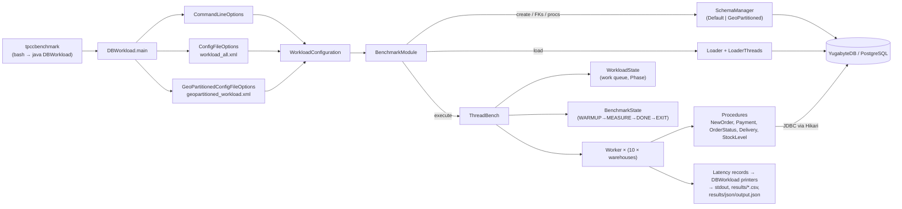
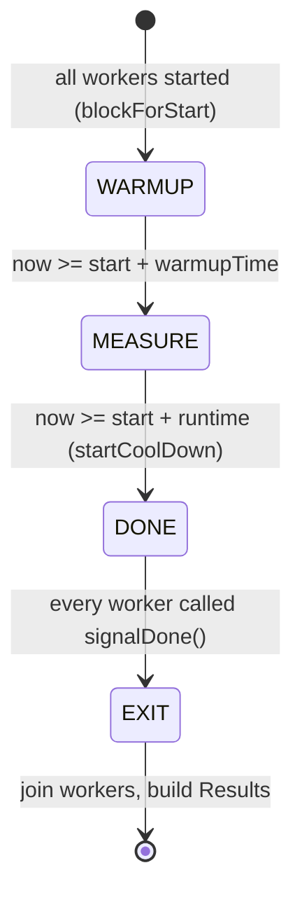
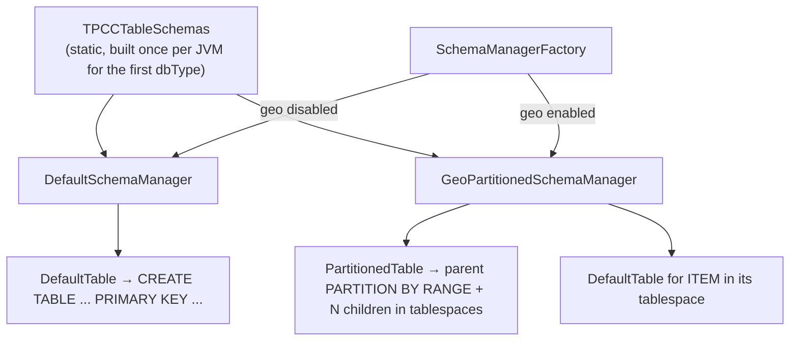
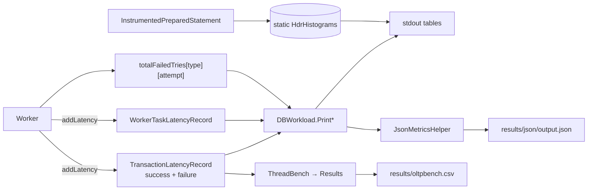

# Architecture

How the code is put together at runtime. For the file-by-file map see
[PROJECT_STRUCTURE.md](PROJECT_STRUCTURE.md). For what the transactions do, see
[TPCC_WORKLOAD.md](TPCC_WORKLOAD.md).

## 1. Big picture



There is one process and one benchmark ("tpcc"). The OLTPBench plugin layer, dialect files, and
the trace/serial machinery are mostly gone. Some dead remnants are listed in §9.

## 2. Entry point & modes (`DBWorkload.main`)

1. Configure log4j from `-Dlog4j.configuration` (required, or the program throws).
2. Parse CLI flags, then **always** parse the workload XML (it needs `<runtime>`, even for `--help`).
3. If the mode is merge or merge-json, merge and exit.
4. Build the `WorkloadConfiguration`:
   - nodes, warehouses, start warehouse, total warehouses, loader threads;
   - DB settings from the XML; `terminals = 10 × warehouses`;
   - `numDBConnections = --num-connections or min(warehouses, 200 × nodes)`;
   - `GeoPartitionPolicy` (null unless geo is enabled).
5. Create the `BenchmarkModule`. **Hikari pools are created only for `--execute` and `--clear`**
   (`needsExecution`).
6. Register the transaction types from the XML (`initTransactionType` maps names to the 5
   procedure classes; ids are assigned 1..N in XML order).
7. `wrkld.addWork(...)` creates the **single `Phase`**: rate-limited, non-serial, timed,
   `REGULAR` arrival, all terminals active.
8. Dispatch on the mode: create (`createDatabase` + `createSqlProcedures`), clear, load,
   enable-foreign-keys, create-sql-procedures, or execute (`runWorkload`, then write the CSV).

## 3. Connections

There are two connection paths in `BenchmarkModule`:

| Path | Used by | Implementation |
|------|---------|----------------|
| `makeConnection()` | create, load (each `LoaderThread`), FKs, procedures | A fresh, un-pooled connection, round-robin over `--nodes` (static counter). `yugabyte`: `YBClusterAwareDataSource` with `jdbc:yugabytedb://host:port/db`. Otherwise `DriverManager` with `jdbc:postgresql://...`. `reWriteBatchedInserts=true`. A non-empty `<jdbcURL>` replaces the URL for every connection, with no round-robin. |
| `getDataSource()` | execute (`Worker`), clear | One `HikariDataSource` per node, each sized `ceil(numDBConnections / nodes)`. `maxLifetime=0`. Isolation set on the pool. `dataSourceClassName` is `YBClusterAwareDataSource` or `PGSimpleDataSource`. `<jdbcURL>` is set but **ignored** by Hikari when `dataSourceClassName` is present (K19). |

Each `Worker` picks its pool once, in its constructor (round-robin), so terminals are spread
evenly across the pools (one per `--nodes` entry) for the whole run. With `dbtype=yugabyte`,
`YBClusterAwareDataSource` load-balances by default, so a pool's physical connections may land on
any tserver, not just its seed node. A terminal holds a connection **only while running a
transaction**. The connection is returned to the pool before the think-time sleep.

## 4. Execution engine

### 4.1 Threads

| Thread | Count | Role |
|--------|-------|------|
| main (`ThreadBench.runRateLimitedMultiPhase`) | 1 | Drives the phase clock, fills the work queue at `rate`/s, flips states. |
| `Worker` | `terminals` = 10 × warehouses | One emulated terminal each, bound to `(w_id, d_id)`. |
| `MonitorThread` | 0/1 (`-im`) | Prints interval throughput. |
| `WatchDogThread` | 1 at shutdown | Logs which workers are still alive while joining (60 s join timeout each). |

Any uncaught exception in a worker thread calls **`System.exit(-1)`** (`ThreadBench.uncaughtException`).

### 4.2 State machine (`BenchmarkState`)



`COLD_QUERY`/`LATENCY_COMPLETE` belong to the OLTPBench "serial/latency" mode. They are
unreachable here because the only phase is non-serial and timed.

### 4.3 Work queue (`WorkloadState`)

- The main thread calls `addToQueue(n)` every `1/rate` seconds. Each entry is a
  `SubmittedProcedure` with a type chosen by `Phase.chooseTransaction()` (weighted random).
- The queue is capped at **10,000**; the oldest entries are dropped on overflow.
- Workers block in `fetchWork()` until an entry is available, or return null at `DONE`/`EXIT`.

So `<rate>` is an upper bound on offered load. With keying and think times on, terminals are
asleep most of the time, the queue stays full, and throughput is bounded by the terminal count.
This is the closed loop TPC-C intends.

### 4.4 Worker loop (`Worker.run`)

```text
loop:
  if state == DONE: signalDone(); break
  work = fetchWork()                                  # Fetch Work
  sleep(keyingTime(work.type))                        # Keying
  attempts = doWork(work)                             # Op With Retry
  sleep(thinkTime(work.type))                         # Thinking
  if state(after) == MEASURE and state(before) in {WARMUP, MEASURE} and same phase:
      record success attempts -> latencies
      record failed attempts  -> failureLatencies, totalFailedTries[type][attempt]
      record task breakdown   -> workerTaskLatencyRecord
```

### 4.5 One transaction (`Worker.doWork` → `executeWork`)

```text
conn = pool.getConnection()
if dbtype == yugabyte: SET yb_enable_expression_pushdown to on   # errors swallowed
if type != StockLevel: conn.setAutoCommit(false)                 # errors swallowed
for attempt in 1..(1 + maxRetriesPerTransaction), while state != DONE:
    status = UNKNOWN
    try:   proc.run(conn, ...); if !autocommit: conn.commit()    -> SUCCESS
    catch UserAbortException: rollback                           -> USER_ABORTED (success), stop
    catch SQLException: rollback (errors ignored)
                        -> RETRY if SQLState != null, else stays UNKNOWN (loop exits, no retry)
    catch Error | Exception:                                     -> RETRY, *no rollback* (K20)
    if type != NewOrder: stop                                    # only NewOrder retries
conn.close()
```

The district range is passed to `proc.run` like this: 1..10 for NewOrder, Payment and
OrderStatus; the terminal's fixed district for Delivery and StockLevel.

## 5. Procedures layer

- `api/Procedure` is the abstract base. It has `run(...)` and `getPreparedStatement(conn, InstrumentedSQLStmt)`.
- Each procedure declares its base SQL as **`public static final InstrumentedSQLStmt`** fields. The
  SQL text and its HdrHistogram are shared by all workers. NewOrder's per-size variants (below)
  are per-instance arrays that reuse the shared base histograms.
- `BenchmarkModule.getProcedures()` creates **a new procedure instance per `Worker`**. Procedures
  keep `InstrumentedPreparedStatement` fields as per-call scratch state, so they are not
  thread-safe and must stay per-worker.
- Statements are re-prepared on every call (`conn.prepareStatement`). Server-side reuse comes from
  the JDBC driver's statement cache (pgjdbc prepares server-side after `prepareThreshold`
  executions).
- `InstrumentedPreparedStatement` wraps `PreparedStatement`, times `execute*` calls into the
  statement's histogram when `trackPerSQLStmtLatencies` is on, and exposes only the setters the
  procedures use.
- `NewOrder` builds statement variants per IN-list or VALUES size in its constructor:
  15 ITEM selects, 15 STOCK selects, 15 `CALL updatestockN`, 11 ORDER_LINE inserts.

## 6. Schema layer



- `TPCCTableSchemas.updateTableSchema(dbType)` caches the table map in a **static** field the first
  time it is called. `Table.getInsertDml` (used by the loader) reads it through
  `DBWorkload.dbtype`. Mixing dbtypes in one JVM is not supported.
- `SchemaManager` also owns FK drop/add and creation of the `updatestockN` and `getstockcounts`
  routines.

## 7. Loader

`Loader.createLoaderThreads()` returns `[ITEM thread, one thread per warehouse, FK thread]`, and
`ThreadUtil.runNewPool` runs them with `--loaderthreads` concurrency. Each `LoaderThread` opens its
own `makeConnection()` with autocommit off. See
[TPCC_WORKLOAD.md §5](TPCC_WORKLOAD.md#5-initial-data-population) for what is generated.

Important behaviors:

- Each `load*` method **catches every exception, logs it, rolls back and returns**. A failed table
  does not fail the run.
- `performInsertsWithRetries` executes the current batch on prepared statement *i* for attempt
  *i*, commits, then clears **all** statements' batches.

## 8. Metrics pipeline



`LatencyRecord` stores samples in chunks of 200 (`ALLOC_SIZE`) to keep per-terminal memory low.
Every recorded transaction is kept in memory until the run ends.

## 9. Legacy / dead code you will run into

| Item | Status |
|------|--------|
| `TraceReader`, serial/latency phases, `Phase.Arrival.POISSON` | Code paths exist but are never configured |
| `Results.txnSuccess/txnAbort/txnRetry/txnErrors` histograms and `--histograms` | Never incremented; the flag can't be enabled (see the code review guide) |
| `src/META-INF/persistence.xml`, Hibernate/JPA dependencies | OLTPBench leftovers, not used by TPC-C |
| `TestLoadedCluster` | Not runnable (empty `main`, invalid `getInt(0)`) |
| `BenchmarkModule.test()` / `NewOrder.test()` | NewOrder correctness harness; not reachable from the CLI |
| `tools/` (python2 plotting, `rs-sysmon`/dstat) | OLTPBench-era utilities, unmaintained |
| `build.xml` targets `execute`, `dialects-export`; `log4j.properties` loggers for other benchmarks | Stale |
| `stand-alone-testing-of-alt-sql-from-proc-solns/` | A 2020 research study (PL/pgSQL vs client-side NewOrder). Not part of the build. |
